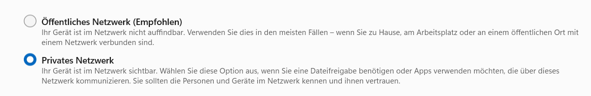

# Backend Server

Server Code, the heart of the system.

# Index

- [Backend Server](#backend-server)
- [Index](#index)
- [Scope / Purpose](#scope--purpose)
- [Development](#development)
  - [Requirements](#requirements)
  - [Setup](#setup)
  - [Run](#run)
  - [Debug in VS-Code](#debug-in-vs-code)
  - [Test](#test)
  - [Build](#build)
  - [Code format](#code-format)
  - [Testing Websocket](#testing-websocket)
    - [Submit a generic confirm](#submit-a-generic-confirm)
    - [Submit player count](#submit-player-count)
    - [Roll a category](#roll-a-category)
    - [Submit an Answer](#submit-an-answer)
- [Related Content](#related-content)

# Scope / Purpose

Backend has the following tasks:

* Handles Game State
* Connects to the [hybrid die](https://gitlab.mi.hdm-stuttgart.de/quizzit/hybrid-die)
* future: Connects to the Hue Lights

The backend is in flow-control when the game is running.

The api and communication flow with the client web app is described in [the api folder](https://gitlab.mi.hdm-stuttgart.de/quizzit/backend-server/-/tree/main/api).

# Development

Directory structure as seen in ["Golang Standard Project Layout"](https://github.com/golang-standards/project-layout)

## Requirements

* Golang 1.20 or higher
* npm to generate GO code from api spec

## Setup

Download dependencies and generate GO code from api spec.

    go mod download
    npm i
    go generate cmd/quizzit/quizzit.go (generates golang types from the ./api/websocket-asyncapi.yaml)

## Run

To start the server:
    
    go run cmd/quizzit/quizzit.go

The server will start listening on http://localhost:8080.

**If you are using Windows and want to use the [Hybrid Die](../hybrid-die/) make sure you are in the same `private` Network as the die. `Private` referes to your system's security settings of this Network. For windows, see the screenshot below.**


## Debug in VS-Code

Possible VS-Code `.vscode/launch.json` configuration:

```json
{
  // Use IntelliSense to learn about possible attributes.
  // Hover to view descriptions of existing attributes.
  // For more information, visit: https://go.microsoft.com/fwlink/?linkid=830387
  "version": "0.2.0",
  "configurations": [
    {
      "name": "Quizzit GO",
      "type": "go",
      "request": "launch",
      "mode": "auto",
      "program": "${workspaceFolder}/backend/cmd/quizzit/quizzit.go",
      "cwd": "${workspaceFolder}/backend",
      "trace": "trace"
    }
  ]
}
```

## Test

    go test ./test

## Build

To build the binary:

    go build cmd/quizzit/quizzit.go

This will create a binary named quizzit in the project directory.

## Code format

Golang has a built-in command-line tool called go fmt that automatically formats Go source code. The go fmt command formats your code according to a set of rules defined in the Go code [style guidelines](https://go.dev/doc/effective_go#formatting).

*Could be implemented in CI/CD in the future.*

## Testing Websocket

Can use this lovely page here: https://websocketking.com/ and connect to `ws://localhost:8080/ws`.  
Some examples for valid JSONs are listed below, for all possible event, view the [api specification](https://gitlab.mi.hdm-stuttgart.de/quizzit/backend-server/-/blob/main/api/websocket-asyncapi.yaml).

### Submit a generic confirm

```json
{
  "messageType": "player/generic/Confirm"
}
```

### Submit player count

```json
{
  "messageType": "player/setup/SubmitPlayerCount",
  "body": 3
}
```

### Roll a category

```json
{
  "messageType": "player/die/DigitalCategoryRollRequest"
}
```

### Submit an Answer

```json
{
  "messageType": "player/question/SubmitAnswer",
  "body": {
    "questionId": "question-1",
    "answerId": "C"
  } 
}
```

# Production

## Create deployment

To create a deployable gitlab release, go to the [tag section](https://gitlab.mi.hdm-stuttgart.de/quizzit/backend-server/-/tags/) of the backend repository in gitlab. 

Create a new tag with a specified new version number (e.g. v1.0.0).

A new release will be created, which can be found in the [deploy section](https://gitlab.mi.hdm-stuttgart.de/quizzit/backend-server/-/releases).

In production the backend runs as binary on a RaspberryPi 4B along with the client web app. For more information regarding deploying to production, look into [the RaspberryPi Installation Guide](https://gitlab.mi.hdm-stuttgart.de/quizzit/raspberry-pi/-/blob/main/Installation-Guide-RaspberryPi.md).

## System requirenments:

- tested on RaspberryPi 4B
- should run on most systems with:
  * Windows or Linux as operating system
  * Wifi card


# Related Content

* [API Specification](https://gitlab.mi.hdm-stuttgart.de/quizzit/backend-server/-/tree/main/api)
* [Backend Wiki](https://gitlab.mi.hdm-stuttgart.de/quizzit/backend-server/-/wikis/home)
* [Game Loop](https://gitlab.mi.hdm-stuttgart.de/quizzit/backend-server/-/wikis/home)
* [RaspberryPi Installation Guide](https://gitlab.mi.hdm-stuttgart.de/quizzit/raspberry-pi/-/blob/main/Installation-Guide-RaspberryPi.md)
* [Go Generate](https://go.dev/blog/generate)
